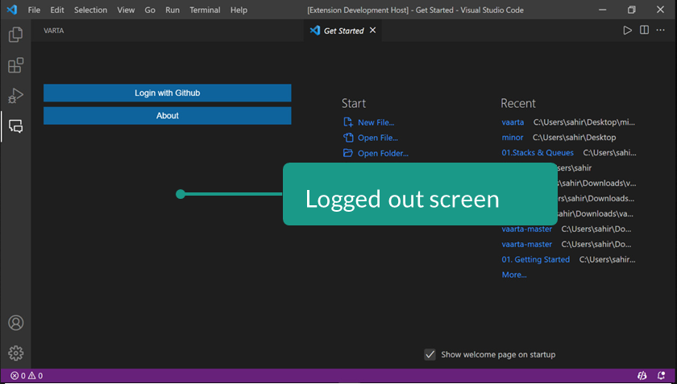
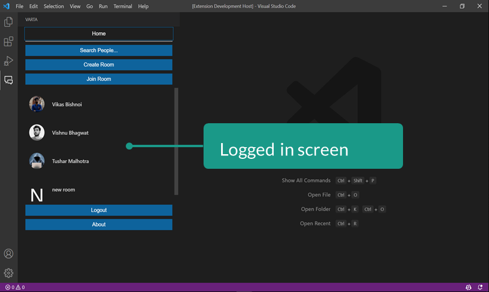
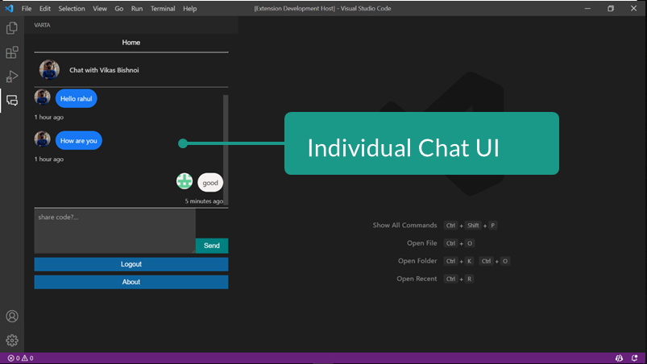
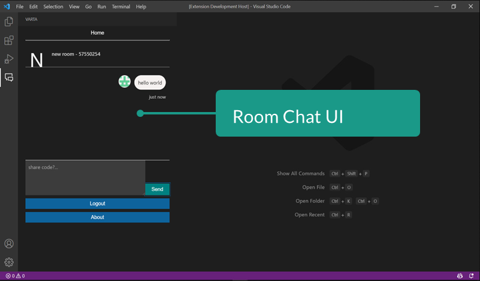

# vaarta

## About

Vaarta is a VSCode Extension. In the app, participants can search and find different users by logging onto GitHub and start a chat room with the other
person directly from the VSCode app.

> The main technologies used in order to bring the application to realization are

- Typescript
- JavaScript
- SvelteJS.
- The UI and interactive functions of the applications will be coded in SvelteJS and JavaScript.

> SvelteJS was specifically chosen in order to develop this application as it has one of most active developer communities and is a highly in demand frontend framework.

> JavaScript will be used with JSX to write react components and functions. Most of the code written will be in JavaScript.

## Images

1. Login/Signup Screen
   

2. Home Page
   

3. Chat Screen
   

4. Group Chat
   

## Future Plans

This project can further be developed to allow users to remotely share their screen. It can also be modified to allow real time video conversation through webrtc and
allow users to share documents and pieces of information.
An organization can create a common group for all their developers in one place and further grouping of the developers can be done depending upon the category
of their work.
